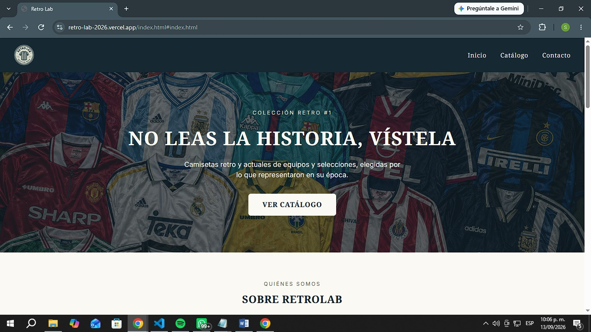
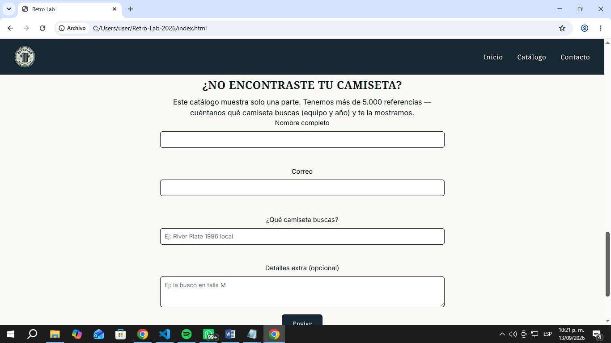
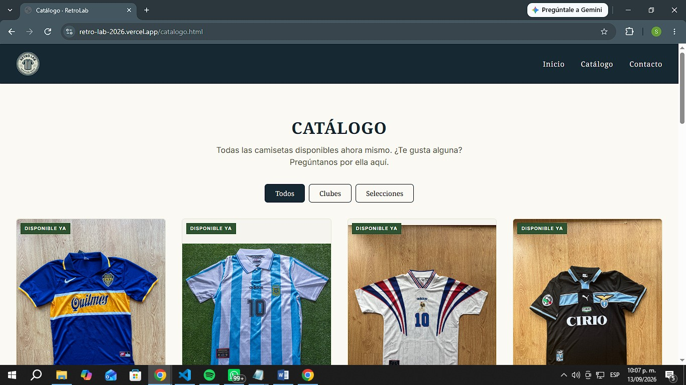
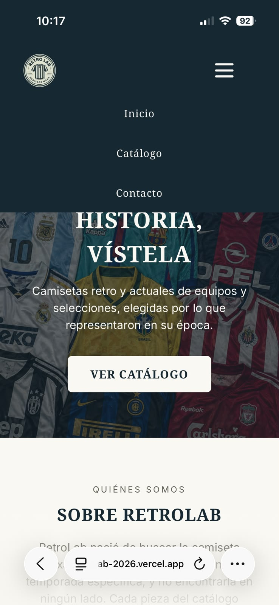
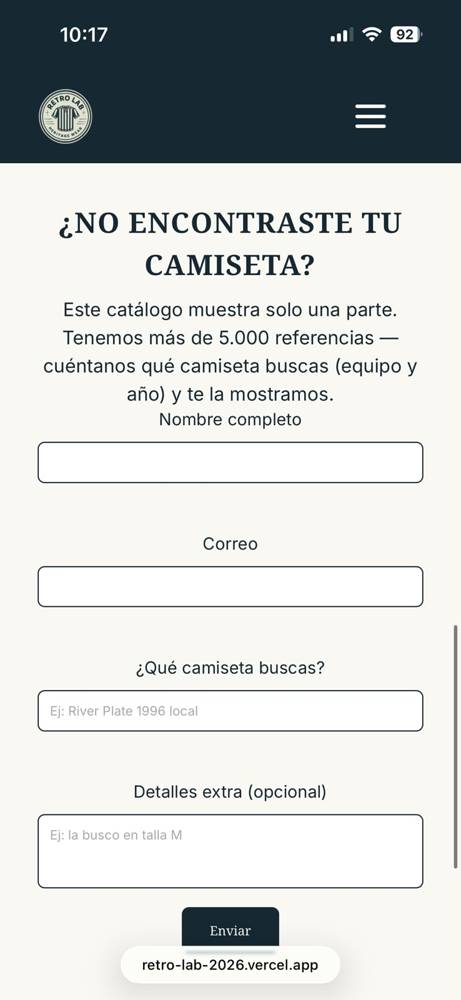
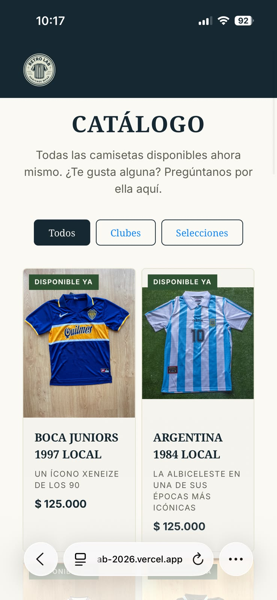

# RetroLab

## Descripción del proyecto

Retro Lab fue una idea que me surgió hace ya poco mas de un año, a raíz de que me gusta bastante el futbol y todo lo relacionado a él. Un día navegando en Internet encontré un proveedor, probé con camisetas para mi y me di cuenta que podía montar un emprendimiento con esto.

Retro Lab es para todas las personas que siempre han soñado con tener parte de su infancia/juventud en la que veían a grandes jugadores vestir grandes camisetas, por medio de esta tienda, se puede conseguir prácticamente la camiseta que te imagines, a dia de hoy contamos con mas de 5000 referencias que el cliente puede escoger según sus gustos.

## Demo

- **Sitio en Vercel:** https://retro-lab-2026.vercel.app/
- **Repositorio:** https://github.com/suribe27/Retro-Lab-2026

## Capturas

### Escritorio

### Móvil

## Decisiones técnicas

### Flexbox y Grid

Utilicé **Flexbox** en varias partes de la página, como el header, el nav, el hero, los filtros, las estadísticas, las redes sociales, los campos del formulario y los testimonios. Lo utilicé principalmente porque en estas secciones necesitaba organizar los elementos en una misma dirección y controlar fácilmente su alineación y distribución. En estos casos no era necesario trabajar con filas y columnas al mismo tiempo.

Por otro lado, utilicé **CSS Grid** principalmente para el catálogo de camisetas. En este caso sí necesitaba organizar los productos en filas y columnas, además de aprovechar de mejor manera el espacio disponible dependiendo del tamaño de la pantalla. Esto también permite que el catálogo se vea más ordenado y se adapte a diferentes dispositivos.

### JavaScript

Para el catálogo utilicé un **arreglo de objetos** donde se encuentra la información de cada camiseta, como su nombre, equipo, año, precio, imagen y categoría. Este arreglo fue reutilizado de una página web que había creado anteriormente para mi tienda (https://retro-lab-two.vercel.app), por lo que pude aprovechar una estructura que ya tenía y adaptarla a este proyecto.

También utilicé **Cloudinary** para las imágenes, ya que en mi otra página web manejo una gran cantidad de fotografías de camisetas. En lugar de guardar todas las imágenes directamente dentro del proyecto, utilizo los enlaces de Cloudinary. Esto evita tener que meter todos los archivos de imagen dentro del proyecto y ayuda a mantenerlo más ligero y organizado.

A partir de la información del arreglo, JavaScript se encarga de **crear las tarjetas de las camisetas automáticamente**. Para esto, toma los datos de cada objeto, como el nombre, precio, año e imagen, y con esa información construye la estructura que después aparece en el catálogo. De esta manera, no es necesario escribir manualmente cada camiseta en el HTML.

También implementé los **filtros por categoría**. Cuando el usuario selecciona uno de los botones, JavaScript identifica la categoría seleccionada y muestra únicamente las camisetas que pertenecen a ella. El botón de "Todos" permite volver a mostrar todo el catálogo.

Además, JavaScript controla el **menú de navegación en dispositivos móviles**. Al presionar el botón del menú hamburguesa, se muestra o se oculta la navegación, haciendo que la página sea más cómoda de utilizar en pantallas pequeñas.

Por último, JavaScript se encarga de la **validación del formulario de contacto**. Antes de permitir que se envíe, revisa que los campos estén completos y que la información tenga un formato válido. En el nombre se verifica que tenga al menos 3 caracteres, en el correo se comprueba que tenga un formato de email válido y también se verifica que se haya ingresado la camiseta que se está buscando. Si algún campo tiene un error, se muestra un mensaje indicando qué se debe corregir. Si todos los campos son correctos, se muestra un mensaje de envío exitoso y se limpia el formulario.

### ¿Para qué usaste la IA y qué cambiaste tú del resultado?

La IA es un apoyo muy grande para este tipo de proyectos, básicamente la use para todo el tema de diseño y paleta de colores, también cuando había algo que no entendía bien y por qué no me estaba dando, le mandaba el código que tenía y me respondía que era lo que estaba mal. Por ejemplo, cuando lo estaba haciendo responsive, el menú hamburguesa me estaba quedando en la mitad y no a un costado, y también no lograba que cuando le daba a una parte de la barra de navegación en celular esta se volviera a ocultar.

Al no ser tanta lógica como pueden ser otras materias como análisis de algoritmos, se hace más fácil cambiar código y saber bien que es lo que se esta haciendo.

### ¿Qué fue lo más difícil y cómo lo resolviste?

Lo que más me costó fue hacer que el menú de navegación se viera correctamente en celular. Al principio, el botón del menú hamburguesa aparecía en la mitad del header en vez de quedar al lado derecho. Lo que hizo más difícil solucionarlo fue que al principio no entendía por qué estaba pasando, ya que el botón tenía las propiedades necesarias para estar a la derecha, pero aun así no se posicionaba como esperaba.

Después de revisar cómo estaban organizados los elementos del header, entendí que el problema estaba en que el logo, el botón y el menú de navegación estaban siendo tratados como elementos separados. Cuando el menú estaba cerrado en celular, este ocupaba muy poco espacio y hacía que el espacio disponible se repartiera de una forma que terminaba dejando el botón en el medio.

Para solucionarlo, agrupé el botón hamburguesa y el menú de navegación en un mismo contenedor. Así, el header solo tenía que organizar dos elementos principales: el logo a la izquierda y el grupo del menú a la derecha. Después hice varias pruebas en diferentes tamaños de pantalla hasta comprobar que funcionara correctamente tanto en computador como en celular.
